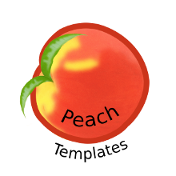

peach-templates
===



Very very simple templates.

Install
---

`npm install peach-templates`

<!-- START doctoc generated TOC please keep comment here to allow auto update -->
<!-- DON'T EDIT THIS SECTION, INSTEAD RE-RUN doctoc TO UPDATE -->
**Contents**

- [Usage](#usage)
  - [Create a render function](#create-a-render-function)
  - [You're not into for of loops](#youre-not-into-for-of-loops)
  - [Asynchronous templates](#asynchronous-templates)
- [About](#about)

<!-- END doctoc generated TOC please keep comment here to allow auto update -->

Usage
---

### Create a render function

```javascript
import { present } from 'peach-templates';
const print = console.log.bind(console);

function render(str, obj, defaults){
    const tpl = present(str, obj, defaults);

    let results = '';

    //Each iterator item produces three values
    for(const [str, val, prop] of tpl){
        //str is the string before the variable
        //val is the value of the obj
        results += str + val;
    }

    //results really does contain
    //the whole modified string
    return results;
}

//Normal template processing
print(render('Cook the %(type) pie.', {
    type: 'peach'
}));

//Functions are run to get the return value
print(render('Cook the %(type) pie.', {
    type(){
        return 'apple'
    }
}));

//This pie type is undefined
print(render('Cook the %(type) pie.'));

//The pie type is still undefined
//A default is used instead
print(render('Cook the %(type) pie.', {}, {
    type: 'peach'
}));

//Get sub properties with a dot
print(render('Cook the %(pie.type) pie.', {
    pie: {type:'cherry'}
}));

//Cook the peach pie.
//Cook the apple pie.
//Cook the undefined pie.
//Cook the peach pie.
//Cook the cherry pie.
```

### You're not into for of loops

```javascript
import { present } from 'peach-templates';
const print = console.log.bind(console);

function render(str, obj, defaults){
    const tpl = present(str, obj, defaults);

    let results = '';

    //For some reason you don't want to use for of
    while(true){
        let next = tpl.next();
        if(next.done) break;
        let [str, val, prop] = next.value;
        results += str + val;
    }

    return results;
}
```

### Asynchronous templates

The new [for await](https://github.com/tc39/proposal-async-iteration) syntax is coming soon.

**Use at your own risk, or for fun!**

```javascript
import { asyncPresent as present} from 'peach-templates';
import Promise from 'bluebird';

const readFile = Promise.promisify(require('fs').readFile);
const print = console.log.bind(console);

function readJSON(name){
    return readFile(name, 'utf8')
    .then(contents=>{
        try{
            return JSON.parse(contents);
        }catch(e){ return Promise.reject(e); }
    });
}

async function render(str, obj, defaults){
    const tpl = present(str, obj, defaults);

    let results = '';

    for await (const [str, val, prop] of tpl){
        results += str + val;
    }

    return results;
}

//Pie types are asynchronous values
render('Cook the %(pie.type) pie.', {
    pie: readJSON('pie.json')
}).then(print);

```

About
---

Templates are useful. `peach-templates` are trying to boost that usefulness. Using a minimal boilerplate you can create a very flexible template renderer for a variety of usages.
